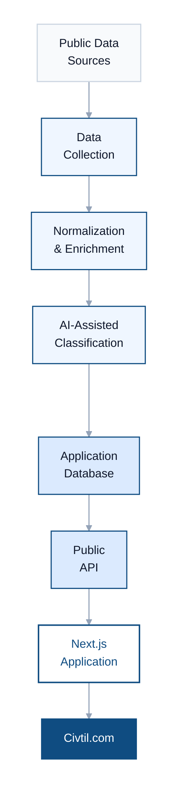

# Civtil

**Local development intelligence from public building records.**

Civtil transforms fragmented municipal permitting data into searchable, easy-to-understand information about what is being built in local communities.

[Visit Civtil](https://civtil.com)

---

## Overview

Local governments publish valuable information about construction, permits, parcels, and development activity, but that information is often difficult for the public to discover and interpret.

Civtil collects and processes public development records and presents them through a modern web application designed to make local development easier to explore.

The platform currently focuses on development activity in Pasco County, Florida.

---

## The Problem

Public development records contain useful information, but they are primarily designed for administrative workflows rather than public discovery.

Common challenges include:

- Inconsistent permit titles and descriptions
- Technical status terminology
- Records distributed across government systems
- Multiple records associated with the same development
- Limited search and filtering capabilities
- Parcel and geographic information separated from permit records
- Large amounts of technical information with little context for the public

Civtil is designed to turn these records into a clearer view of what is being built and where development is happening.

---

## The Solution

Civtil uses an automated data pipeline to collect, standardize, enrich, and publish public development records.

Users can search development activity, filter records, view project information, and explore parcel locations through an interactive web interface.

### Core Capabilities

- Searchable development and permit records
- Standardized development categories
- Simplified project and permit statuses
- Interactive parcel maps
- Project and permit detail pages
- Automated public-record ingestion
- AI-assisted classification and title normalization
- Geographic and parcel context
- Organization of related development records

---

## System Architecture

Civtil uses a layered architecture that separates public-record ingestion, data processing, and the user-facing application.

This separation allows development records to be processed and standardized independently from the public application.

> **Note:** Internal infrastructure, security controls, and production configuration are intentionally omitted from this public case study.
